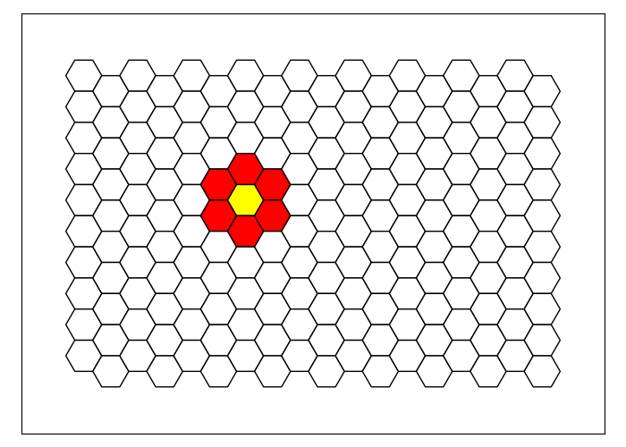

# HexaGen

## Description
The HexaGen project is a component of the larger Hexagons project developed by the [ONLP lab](https://nlp.biu.ac.il/~rtsarfaty/onlp).
For more information about the project, please visit [here](https://onlplab.github.io/Hexagons/).

As a part of the Hexagons project, the Hexagons dataset was collected. 
This dataset consists of 4177 visually grounded instructions that occur naturally and contain a variety of abstraction levels and types. 
The instructions are written in natural language and describe drawings on a hexagonal tiled board.

The purpose of the HexaGen project is to provide a formalism that enables the expression of natural language instructions in executable Python code while maintaining the computational ideas present in the NL utterances. The formalism allows for accurate expression of these ideas using Python code, ensuring that the computational structure of the original NL instructions is preserved.

For instance, the instruction:
>"Draw a red flower with a yellow center, centered at the seventh column and fifth row"

Can be expressed by the following code: 
```python
center = Tile(column=7, row=5)
center.draw(color='yellow')
center.neighbors().draw(color='red')
```
This code uses a `Tile` object that represents a hexagonal tile on the board, the `draw` method that is used to color objects on the board, and the `neighbors` method which returns the six neighboring tiles of the current tile.

The code generates the following image:



## Philosophy
- drawing ideas from the dataset of natural language instructions
- thinking of how to formalize the common computational ideas axpressed by the users in the instructions
- allowing expression of most of the natural language instructions, while keeping the formalism compact and concise
- writing a code that is straightforward to use
- writing methods 

## Requirements

Before you get started, make sure you have the following requirements installed:
  
- Python 3.x
- NumPy
- SciPy

## Usage of the `HexaGen` module
Please refer to our [usage guide](docs/USAGE.md) for detailed instructions on how to use the HexaGen.py module. The guide includes code examples that will help you get started with using the module.

## Reading from the dataset
TODO

## Gold
TODO

## Examples
TODO

## GPT
TODO

## License
TODO

## Acknowledgments
I would like to express my gratitude to Professor Reut Tsarfaty, head of the ONLP lab, for her valuable guidance and support throughout this project. Her expertise and insights have been invaluable.

I would also like to thank my colleagues from the ONLP lab, Dr. Royi Lachmi and Avshalom Manevich, for their collaboration and teamwork. Working with them has been a great pleasure, and I am grateful for their contributions to this project.
