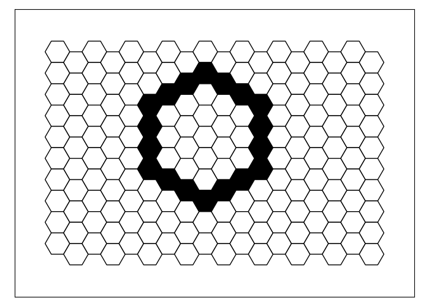

# Usage Guide
Welcome to the usage guide for Hexagons. This guide will provide you with detailed instructions on how to use the various features and functions of our code, including code examples.

## Basic Example: Single Blue Hexagon
This is the code 'frame':
```python
from hexagons_classes import HexagonsGame, Tile, Shape, Line, Circle, Triangle
HexagonsGame.start()

# insert code here

HexagonsGame.plot()
```
For example:
```python
from hexagons_classes import HexagonsGame, Tile, Shape, Line, Circle, Triangle
HexagonsGame.start()

tile = Tile(5,7)
tile.draw('blue')

HexagonsGame.plot()
```

From now on we omit the code frame.
## Creating Tiles
```python
Tile(1,1).draw('red')
Tile(1,-1).draw('blue')
Tile(-1,1).draw('green')
Tile(-1,-1).draw('orange')
```

## Circle
```python
circle = Circle(center_tile = Tile(9, 5), radius = 3)
circle.draw('black')
```

## Shape Class Methods
### Get method
```python
circle = Circle(center_tile = Tile(9, 5), radius = 3)
circle.draw('black')
circle.get(criterion = 'outside').draw('red')
circle.get(criterion = 'inside').draw('green')
```

```python
circle = Circle(center_tile = Tile(9, 5), radius = 3)
circle.draw('black')
circle.get(criterion = 'above').draw('red')
circle.get(criterion = 'below').draw('green')
```

```python
circle = Circle(center_tile = Tile(9, 5), radius = 3)
circle.draw('black')
circle.get(criterion = 'top').draw('red')
circle.get(criterion = 'bottom').draw('green')
```

```python
circle = Circle(center_tile = Tile(9, 5), radius = 3)
circle.draw('black')
circle.get(criterion = 'corners').draw('red')
```

```python
circle = Circle(center_tile = Tile(9, 5), radius = 3) + Tile(-6, -4) + Tile(-5, -4) + Tile(-4, -3)
circle.draw('black')
circle.get(criterion = 'end_points').draw('red')
```


```python
?```

