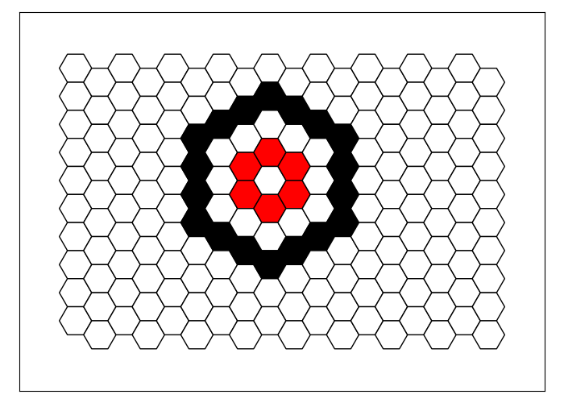
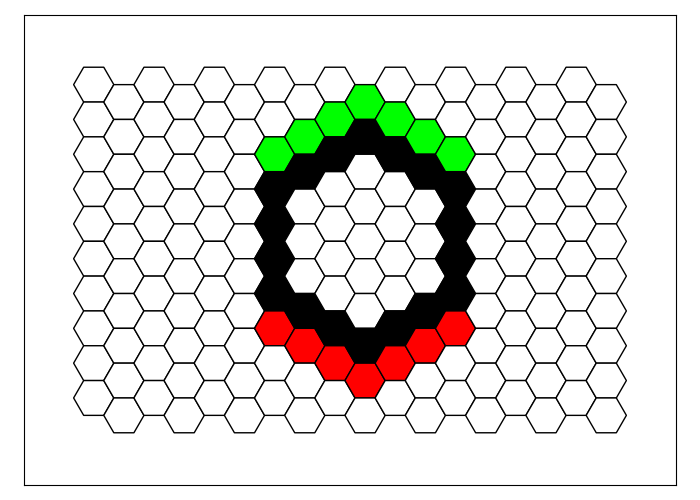
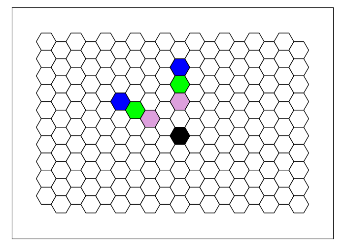

# Usage Guide
Welcome to the Hexagons usage guide. In this guide we provide detailed instructions on how to use the most important features of our Python project, complete with code examples.

The purpose of this project is to allow translation of instructions given in natural language into code. 

### Constants
The `constants.py` file contains the following constants that are used throughout the project:
```python
WIDTH = 18 # the board's width
HEIGHT = 10 # the board's height
COLORS = ['white', 'black', 'yellow', 'green', 'red', 'blue', 'purple', 'orange'] # the supported colors
```

The project also uses the following list of directions on the boardwhich are dictated by the geometry of the Hexagons board and should not be changed:
```python
DIRECTIONS = {'up': (0, -1, 1), 'down': (0, 1, -1), 'down_right': (1, 0, -1), 
              'up_left': (-1, 0, 1), 'down_left': (-1, 1, 0), 'up_right': (1, -1, 0)}
```
## `HexagonsGame` Class

### Code Structure
To plot an image using the Hexagons project, a script should follow the following structure:
```python
from src.hexagons_classes import HexagonsGame, Tile, Shape, Line, Circle, Triangle
HexagonsGame.start()

# insert code here

HexagonsGame.plot()
```
For example:
```python
from src.hexagons_classes import HexagonsGame, Tile, Shape, Line, Circle, Triangle
HexagonsGame.start()

tile = Tile(5,7)
tile.draw('blue')

HexagonsGame.plot()
```
The code generates the following image:


From this point on, we will omit the surrounding code and only present the instructions.

### Methods

#### `record_step` and `get_record`

>draw a red flower with a yellow center, centered at the seventh column and fifth row

can be translated into the following code: 
```python
center = Tile(column=7, row=5)
center.draw(color='yellow')
center.neighbors().draw(color='red')
```
This code uses a `Tile` object that represents a hexagonal tile on the board, the `draw` method that is used to color objects on the board, and the `neighbors` method which returns the six neighboring tiles of the current tile.

The code generates the following image:


## `Tile` Class
To create a tile in Hexagons, use the `Tile` class, that requires two parameters: `column` and `row`. `column` is numbered from 1 (leftmost column) to 18 (rightmost column), while `row` is numbered from 1 (top row) to 10 (bottom row). 
You can also use negative values for column or row to count from the rightmost column or bottom row, respectively.

To assign a color to a tile, use the `draw` method with a single parameter, `color`. 
The `color` parameter should be a string representing any of the available colors in the project,
as defined by the `COLORS` constant.

For example, see the following code and the image it generates:
```python
Tile(column=1, row=1).draw('red')
Tile(column=1, row=-1).draw('blue')
Tile(column=-1, row=1).draw('green')
Tile(column=-1, row=-1).draw('orange')
```


### Attributes
A `Tile` object has the following read-only attributes:
- column: an integer that specifies the tile's column
- row: an integer that specifies the tile's row
- color: a string that specifies the tile's color

### Methods
All the methods of the `Shape` class (which we will describe in future sections) can be applied to `Tile` objects as well.
In particular, two methods that are especially useful for `Tile` objects are `neighbor` and `neighbors`, which we describe below.

#### `neighbor` and `neighbors`
The `neighbors` method returns all the neighboring tiles of the current tile object on the board. 
The `neighbor` method takes a single parameter, `direction`, that specifies one of the six directions on the board, and returns the neighbor of the current tile object in that direction.

Here's an example of how to use these methods:
```python
tile = Tile(9, 5)
tile.draw('black')
tile.neighbors().draw('green')
tile.neighbor(direction='up_right').draw('red')
```


## `Shape` Class 
A shape in Hexagons is any set of tiles on the board, including the empty set and a single tile.
To create a shape in Hexagons, use the `Shape` class, which requires a single parameter: `tiles`. `tiles` is a list of Tile objects that specifies the tiles composing the shape.
```python
shape = Shape(tiles=[Tile(9, 5), Tile(10, 5), Tile(9, 6)])
shape.draw('purple')
```


### Attributes
A `Shape` object has the following read-only attributes:
- tiles: the list of `Tile` object composing the shape
- columns: the list of columns of the tiles composing the shape
- rows: the list of rows of the tiles composing the shape
- colors: the list of colors of the tiles composing the shape

### Subclasses
The `Shape` class has three special subclasses that we now describe: `Circle`, `Line` and `Triangle`.

#### `Circle` Subclass
To create a circle on the board, use the `Circle` class, which requires two parameters: `center_tile` and `radius`. `center_tile` is a tile object that specifies the center tile of the circle. `radius` is an integer that specifies the radius of the circle.  If no value is specified for `radius`, it defaults to `1`.
```python

Circle(center_tile=Tile(9, 5), radius=3).draw('black')
Circle(center_tile=Tile(9, 5)).draw('red')
```


###### Attributes
A `Circle` object has all the attributes of its superclass `Shape`. In addition, it has the following read-only attributes:
- center_tile: a `Tile` object that specifies the center tile of the circle
- color: a string that specifies the color of the circle
      
#### `Line` Subclass
To create a straight line on the board, use the `Line` class.
There are several ways to instantiate a new `Line` object, that we describe below.
Note that the `Line` class also has a unique method called `parallel`. This method will be described in later sections together with all other `Shape` methods.

##### Attributes
A `Line` object has all the attributes of its superclass `Shape`. In addition, it has the following read-only attributes:
- start_tile: a `Tile` object that specifies the starting point of the line
- end_tile: a `Tile` object that specifies the ending point of the line
- color: a string that specifies the color of the line
- direction: a string that specifies the direction of the line

##### Line Instantiation

###### Using `start_tile` and `end_tile`
Specify `start_tile` and `end_tile` as `Tile` objects to define the start and end points of the line.
```python
line = Line(start_tile=Tile(3, 2), end_tile=Tile(-3, -3))
line.draw('blue')
```


###### Using `start_tile`, `direction` and `length`
Use `direction` to specify the direction of the line, and use `length` to specify the length of the line.
```python
line = Line(start_tile=Tile(3, 8), direction='up_right', length=5)
line.draw('blue')
```


###### Using `start_tile` and `direction`
If `length` is not specified, the line will extend until it reaches the edge of the board.
```python
line = Line(start_tile=Tile(3, 8), direction='up_right')
line.draw('blue')
```


###### Using `start_tile`, `direction` and `end_tiles`
Specify a `Shape` object `end_tiles` to stop the line when it reaches any tile belonging to the shape.
```python
circle = Circle(center_tile=Tile(15, 8), radius=2)
circle.draw('red')
line = Line(start_tile=Tile(1, 1), direction='down_right', end_tiles=circle)
line.draw('blue')
```


###### Additional: `include_start_tile` and `include_end_tile` flags
By default, `include_start_tile` and `include_end_tile` are both set to `True`, but you can set them to `False` to omit the starting or ending tile from the line, respectively.
```python
line = Line(start_tile=Tile(9, 1), end_tile=Tile(9, -1), include_start_tile=False, include_end_tile=False)
line.draw('blue')
```


#### Methods
The `Line` subclass has all the methods of its superclass Shape. In addition it has its own unique method: `parallel`.

##### self.parallel(shift_direction, spacing)
The `parallel` method creates a new line of the same direction but potentially different length as the given line. 
This method does not copy the original line. Instead, it creates a new line that extends as far as possible in both directions.

In the example below, a black line is drawn on the board with a length of 5 tiles and an "up_right" direction. 
Then, a new line is created parallel to the original line, shifted downwards by 3 tiles and drawn in red.
```python
line = Line(start_tile=Tile(5, 5), direction='up_right', length=5)
line.draw('black')
line.parallel(shift_direction='down', spacing=3).draw('red')
```


#### `Triangle` Subclass
To create a triangle on the board, use the `Triangle` class, which requires four parameters:
- `start_tile` is a tile object that specifies one of the triangle's vertices.
- `point` is a string that specifies whether the triangle is pointing left (corresponding to the value "left") or right ("right").
- `start_tile_type` is a string that specifies which one of the three vertices of the triangle does `start_tile` describes: its bottom vertex ("bottom"), its top vertex ("top") or its side vertex ("side"). The side vertex is either the left or the right endpoint of the triangle.
- `side_length` is an integer that specifies the length of the side of the triangle. If no value is specified for `side_length`, it defaults to `2`.

The following code demonstrates how to create and draw two different triangles on the Hexagons board using the `Triangle` class.

The first part of the code creates the red triangle, which is pointing right. 
The triangle's location is specified by `Tile(9, 5)`, which is the right vertex of the triangle.
This tile is painted in orange.
The code also specifies the length side of the triangle to be `6`.

The second part of the code creates the blue triangle, which is pointing left. 
The triangle's location is specified by `Tile(15, 8)`, which is the bottom vertex of the triangle.
This tile is painted in green.
The code doesn't specify the length side of the triangle, so it defaults to `2`.

```python
start_tile1 = Tile(9, 5)
triangle1 = Triangle(start_tile=start_tile1, point='right', start_tile_type='side', side_length=6)
triangle1.draw('red')
start_tile1.draw('orange')

start_tile2 = Tile(15, 8)
triangle2 = Triangle(start_tile=start_tile2, point='left', start_tile_type='bottom')
triangle2.draw('blue')
start_tile2.draw('green')
```


###### Attributes
A `Triangle` object has all the attributes of its superclass `Shape`. In addition, it has the following read-only attributes:
- point: a string that specifies whether the triangle is pointing right or left
- side_length: an integer that specifies the length of the side of the triangle
- color: a string that specifies the color of the triangle

### `Shape` Class Methods
The `Shape` class has many useful methods that can be used on any `Shape` object, including objects from any of its subclasses, as well as on `Tile` objects. 
In the following sections we will describe these methods in detail.

#### General Purpose Methods

##### Iteration
The Shape class implements the iterator protocol, which means that you can iterate over the tiles in a shape using a for loop or a list comprehension. For example, the code `for tile in shape:` will iterate over all the tiles in the `Shape` object shape, and you can perform operations on each tile inside the loop body.

In the following example, a line is created and painted in orange, and a purple line is drawn from every even row tile in the direction of 'up_right':
```python
line = Line(start_tile=Tile(6, 1), direction='down')
line.draw('orange')
for tile in line:
  if tile.row % 2 == 0:
    Line(start_tile=tile, direction='up_right', include_start_tile=False).draw('purple')
```


##### `add`, `subtract` and `multiply`
It is possible to use the plus, minus, and asterisk signs to compute the union, difference, and intersection of shapes respectively.
For example, to compute the union of two Shape objects `shape1` and `shape2` use: `shape3 = shape1 + shape2`.
The resulting shape object is a new `Shape` object.

The following example demonstrates the use of `*` to paint the intersection of two circles in red.
```python
circle1 = Circle(center_tile=Tile(7, 5), radius=4)
circle1.draw('green')
circle2 = Circle(center_tile=Tile(-7, 5), radius=4)
circle2.draw('blue')
(circle1 * circle2).draw('red')
```


##### `self.is_empty()` and `self.overlaps(other)`
The `is_empty` method returns `True` if `self` is empty,
while the `overlaps` method returns `True` if `self` and `other` overlap.

#### "Get" Methods
The following methods all have in common that they return a new `Shape` object, and they don't draw anything on the board.

##### `Shape.get_entire_board()` and `Shape.get_board_perimeter()`
These two methods return the entire board and the perimeter of the board, respectively.
```python
Shape.get_entire_board().draw('green')
Shape.get_board_perimeter().draw('blue')
```


##### `Shape.get_color(color)` and `Shape.get_column(column)`
These methods return all the tiles with a specific color, and all the tiles in a specific column, respectively.

##### `self.get(criterion)`
The `get` method returns a new `Shape` object that has some geometric relation to the original shape.
The method requires a single parameter `criterion`, which is a string specifying the criterion used to create the new shape. 
There are several options for the `criterion` parameter, which we will describe below. 

###### "outside" and "inside"
If criterion is set to "outside", the `get` method returns a new shape consisting of all tiles that lie outside of the given shape. 
Conversely, if criterion is set to "inside", the returned shape will consist of all tiles that lie inside the given shape.
```python
circle = Circle(center_tile=Tile(9, 5), radius=3)
circle.draw('black')
circle.get(criterion='outside').draw('red')
circle.get(criterion='inside').draw('green')
```


###### "above" and "below"
If `criterion` is set to "above", the `get` method returns a new shape consisting of all tiles that lie above the given shape. 
Conversely, if `criterion` is set to "below", the returned shape will consist of all tiles that lie below the given shape.
```python
circle = Circle(center_tile=Tile(9, 5), radius=3)
circle.draw('black')
circle.get(criterion='above').draw('red')
circle.get(criterion='below').draw('green')
```


###### "top" and "bottom"
If `criterion` is set to "top", the `get` method returns a new shape that consists of the top portion of the original shape. 
Conversely, if `criterion` is set to "bottom", the returned shape will comprise the bottom portion of the original shape.

```python
circle = Circle(center_tile=Tile(9, 5), radius=3)
circle.draw('black')
circle.get(criterion='top').draw('red')
circle.get(criterion='bottom').draw('green')
```


###### "corners"
If `criterion` is set to "corners", the `get` method returns a shape consisting of the corner tiles of the given shape,
as demonstrated in the following example:
```python
circle = Circle(center_tile=Tile(9, 5), radius=3)
circle.draw('black')
circle.get(criterion='corners').draw('red')
```


###### "endpoints"
If `criterion` is set to "endpoints", the `get` method returns a shape consisting of the endpoints of the given shape,
as demonstrated in the following example:
```python
circle = Circle(center_tile=Tile(9, 5), radius=3) + Tile(-6, -4) + Tile(-5, -4) + Tile(-4, -3)
circle.draw('black')
circle.get(criterion='endpoints').draw('red')
```


##### `self.boundary(criterion='all')`
We define the **boundary** of a shape to be the part of the shape that is adjacent to tiles that are not part of the shape.
The `boundary` method returns the boundary of the given shape.

To illustrate with an example, let's start with the following shape:
<!--
```python
shape = Circle(center_tile=Tile(10, 5), radius=2) + Circle(center_tile=Tile(10, 5), radius=3) + Circle(center_tile=Tile(10, 5), radius=4)
shape.draw('black')
```
-->


Its boundary is shown in purple:
```python
shape.boundary().draw('purple')
```


If we want to get only the outer or inner part of the boundary, we can set the `criterion` parameter to "outer" or "inner" respectively:
```python
shape.boundary(criterion='outer').draw('red')
shape.boundary(criterion='inner').draw('green')
```


##### `self.extreme(direction)`
The `extreme` method returns a `Shape` object consisting of the most extreme tiles of the given shape in the given direction,
as demonstrated in the following example:

```python
circle = Circle(center_tile=Tile(10, 5), radius=3)
circle.draw('black')
circle.extreme(direction='up').draw('green')
circle.extreme(direction='down_right').draw('red')
```


##### `self.edge(direction)`
The `edge` method returns a `Shape` object consisting of the edge tiles of the given shape in the given direction,
as demonstrated in the following example:

```python
circle = Circle(center_tile=Tile(10, 5), radius=3)
circle.draw('black')
circle.edge(criterion='up').draw('green')
circle.edge(criterion='right').draw('red')
```


##### `self.neighbors(criterion='all')`
We define the **neighbors** of a shape to be the set of tiles that are adjacent to the shape but are not part of it.
The `neighbors` method returns a new `Shape` object consisting of the neighbors of the given shape, 
or some subset of them based on the value of the `criterion` parameter.
There are several options for the `criterion` parameter, which we will describe below. 
If no value is specified for `criterion`, it defaults to "all".

###### "all" 
If `criterion` is not specified or it is set to "all", the `neighbors` method returns a new shape consisting of all the neighbors of the given shape.
```python
circle = Circle(center_tile=Tile(10, 5), radius=3)
circle.draw('black')
circle.neighbors().draw('green')
```


###### "right" and "left"
If `criterion` is set to "right", the `neighbors` method returns a new shape consisting of the neighbors of the given shape that lie to the right of the given shape. 
Conversely, if `criterion` is set to "right", the returned shape will consist of the neighbors that lie to the left of the given shape. 
```python
circle = Circle(center_tile=Tile(10, 5), radius=3)
circle.draw('black')
circle.neighbors(criterion='right').draw('green')
circle.neighbors(criterion='left').draw('red')
```


###### "above" and "below"
If `criterion` is set to "above", the `neighbors` method returns a new shape consisting of the neighbors of the given shape that lie above the given shape. 
Conversely, if `criterion` is set to "below", the returned shape will consist of the neighbors that lie below the given shape. 
```python
circle = Circle(center_tile=Tile(10, 5), radius=3)
circle.draw('black')
circle.neighbors(criterion='above').draw('green')
circle.neighbors(criterion='below').draw('red')
```


###### "outside" and "inside"
If `criterion` is set to "outside", the `neighbors` method returns a new shape consisting of the neighbors of the given shape that lie outside the given shape. 
Conversely, if `criterion` is set to "inside", the returned shape will consist of the neighbors that lie inside the given shape. 
```python
circle = Circle(center_tile=Tile(10, 5), radius=3)
circle.draw('black')
circle.neighbors(criterion='outside').draw('green')
circle.neighbors(criterion='inside').draw('red')
```


###### "white"
If `criterion` is set to "white", the `neighbors` method returns a new shape consisting of all the neighbors of the given shape that are not colored.
```python
circle = Circle(center_tile=Tile(10, 5), radius=3)
circle.draw('black')
Tile(14, 6).draw('blue')
circle.neighbors(criterion='white').draw('green')
```


###### Any direction
If `criterion` is set to a direction, the `neighbors` method returns a new shape consisting of all the neighbors of the given shape that lie in that direction from the given shape.
```python
circle = Circle(center_tile=Tile(10, 5), radius=3)
circle.draw('black')
circle.neighbors(criterion='up_right').draw('green')
```


#### "Draw" Methods
The following methods all have in common that they draw something new on the board. 
Some of them also return a new `Shape` object, while others return nothing.

##### self.draw(color)
Draw the tiles of the given shape in the given color.

##### self.copy_paste(shift_direction, spacing, reference_shape=None)
The `copy_paste` method draws a copy of the given shape in a new location on the board. 
The new location is specified by the following parameters:
- `shift_direction`: a string that specifies the direction of the new shape relative to the given shape.
- `spacing`: an integer that specifies the desired spacing between the given shape and the new shape.
- `reference_shape`: a `Shape` object. If specified, the new location will be computed relative to
the location of `reference_shape` rather than the given shape.

The new shape is also returned by the method, so we can use it for further manipulations.

The following example demonstrates the usage of the `copy_paste` method:
It first draws a black circle on the board and then creates a copy of it 
located down and to the right of the original circle, with a spacing of two tiles.
```python
circle1 = Circle(center_tile=Tile(4, 4), radius=2)
circle1.draw('black')
circle2 = circle1.copy_paste(shift_direction='down_right', spacing=2)
```


The following example demonstrates the usage of the `reference_shape` parameter:
First, a black circle and a purple shape are drawn on the board.
Then, a copy of the black circle is created, located to the right of the purple shape specified as the reference, with a spacing of one tile.
```python
circle1 = Circle(center_tile=Tile(4, 4), radius=2)
ref_shape = Shape(tiles=[Tile(11, 6), Tile(11, 7), Tile(12, 6)])
circle1.draw('black')
ref_shape.draw('purple')
circle2 = circle1.copy_paste(shift_direction='right', spacing=1, reference_shape=ref_shape)
```


##### self.grid(shift_direction, spacing, num_copies=None)
The `grid` method draws multiple copies of the given shape on the board in even spacings, based on the `shift_direction` and `spacing` parameters, with a total number of copies specified by the `num_copies` parameter.
If the `num_copies` parameter is not specified, the method creates the maximal possible number of complete copies.

The following code creates a black shape on the board and draws two additional copies to the right of the original shape, 
with a spacing of two tiles between each copy.
```python
shape = Shape([Tile(1, 4), Tile(1, 5), Tile(2, 4)])
shape.draw('black')
shape.grid(shift_direction='right', spacing=2, num_copies=2)
```


The following code creates a black shape on the board and draws the maximal possible number of complete copies to the right of the original shape, with a spacing of two tiles between each copy.
```python
shape = Shape([Tile(1, 4), Tile(1, 5), Tile(2, 4)])
shape.draw('black')
shape.grid(shift_direction='right', spacing=2)
```


##### reflect(axis_line=None, column=None, axis_direction=None, tile_on_axis=None)
The `reflect` method draws a reflection of the given shape across a given axis line.
The axis line can be specified in several ways. We describe each of them with an example.

###### Using `axis_line`
The axis line is specified directly by a `Line` object, as demonstrated in the following example:
```python
blue = Tile(3, 3)
blue.draw('blue')
green = Line(start_tile=Tile(3, 4), direction='up_right', length=2)
green.draw('green')
purple = Line(start_tile=Tile(3, 5), direction='up_right', length=3)
purple.draw('purple')
shape = blue + green + purple
line = Line(start_tile=Tile(4, 7), direction='up_right')
line.draw('black')
shape.reflect(axis_line=line)
```


###### Using `column`
The axis line is provided by an integer that specifies a column number, as demonstrated in the following example:
```python
blue = Tile(3, 3)
blue.draw('blue')
green = Line(start_tile=Tile(3, 4), direction='up_right', length=2)
green.draw('green')
purple = Line(start_tile=Tile(3, 5), direction='up_right', length=3)
purple.draw('purple')
shape = blue + green + purple
shape.reflect(column=8)
```


###### Using `axis_direction` and `tile_on_axis`
The axis line is provided by a direction and a `Tile` object, which together specify a line, as demonstrated in the following example:
```python
blue = Tile(3, 3)
blue.draw('blue')
green = Line(start_tile=Tile(3, 4), direction='up_right', length=2)
green.draw('green')
purple = Line(start_tile=Tile(3, 5), direction='up_right', length=3)
purple.draw('purple')
shape = blue + green + purple
tile = Tile(8, 4)
tile.draw('black')
shape.reflect(axis_direction='up_left', tile_on_axis=tile)
```


##### self.rotate(center_tile, rotation)
The `rotate` method is used to create a rotated copy of the given shape. The method takes two parameters:
- `center_tile`: a Tile object that specifies the center of rotation
- `angle`: an integer that specifies the counterclockwise rotation angle, in degrees. This parameter should always be a multiple of 60.
The method rotates the given shape around the center_tile by the rotation angle.

Here's an example that demonstrates the usage of the `rotate` method. In this example, we have three tiles of different colors, and we want to rotate them counterclockwise by 60 degrees around the black tile at the center of the board.
```python
blue = Tile(10, 2)
blue.draw('blue')
green = Tile(10, 3)
green.draw('green')
purple = Tile(10, 4)
purple.draw('purple')
center_tile = Tile(10, 6)
center_tile.draw('black')
(blue + green + purple).rotate(center_tile=center_tile, angle=60)
```


##### self.recolor(color_map)
The `recolor` method changes the colors of the tiles in a shape according to a specified mapping.
The `color_map` parameter is a dictionary that maps old colors to new colors.
Each key-value pair in the dictionary specifies a mapping between a color that may appear in the original shape and the corresponding color that it should be changed to.
For example, if we want to change blue to red, we would include the key-value pair `'blue':'red'` in the dictionary.

In the example, we create the left shape with blue, green and purple tiles. Then we copy it and recolor, using the mapping: blue -> red, green -> orange, purple -> green, red -> black.
```python
blue = Tile(6, 2)
blue.draw('blue')
green = Tile(6, 3)
green.draw('green')
purple = Tile(6, 4)
purple.draw('purple')
shape = (blue + green + purple).copy_paste(shift_direction='right', spacing=3)
shape.recolor({'blue':'red', 'green':'orange', 'purple':'green', 'red':'black'})
```


##### Shape.polygon(vertices)
The `polygon` method creates a new shape object that is a polygon with the given vertices. 
The `vertices` parameter is a list of `Tile` objects that specify the corners of the polygon.
The order of the vertices in the list does not matter, as the method automatically orders them.
```python
vertices = [Tile(5, 5), Tile(8, 3), Tile(5, 7), Tile(8, 8), Tile(13, 6)]
Shape.polygon(vertices=vertices).draw('green')
Shape(vertices).draw('black')
```


