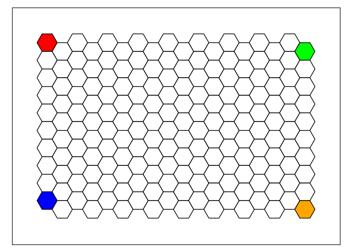
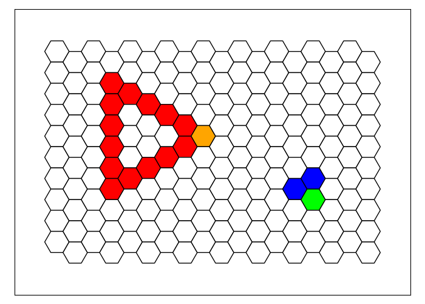
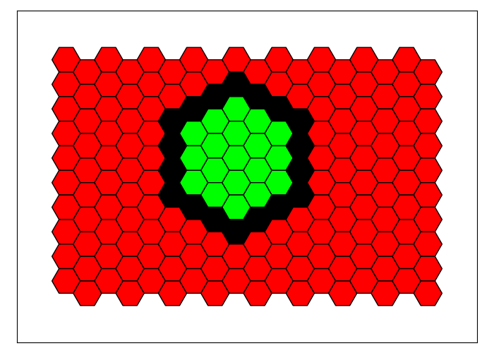

# Usage Guide
Welcome to the Hexagons usage guide. In this guide, we'll provide you with detailed instructions on how to use the most important features of our Python package, complete with code examples.

## Basic Example: Single Blue Hexagon
This is the code so-called 'frame':
```python
from hexagons_classes import HexagonsGame, Tile, Shape, Line, Circle, Triangle
HexagonsGame.start()

# insert code here

HexagonsGame.plot()
```
For example:
```python
from hexagons_classes import HexagonsGame, Tile, Shape, Line, Circle, Triangle
HexagonsGame.start()

tile = Tile(5,7)
tile.draw('blue')

HexagonsGame.plot()
```


From now on we omit the code frame.

## `Tile` Class
To create a tile in Hexagons, use the Tile class. To paint it in a desired color, use the `draw` method. The `Tile` class requires two parameters: `column` and `row`. `column` is numbered from 1 (leftmost column) to 18 (rightmost column), while `row` is numbered from 1 (top row) to 10 (bottom row). If you use a negative value for column or row, the counting will start from the rightmost column or bottom row, respectively.
```python
Tile(column=1, row=1).draw('red')
Tile(column=1, row=-1).draw('blue')
Tile(column=-1, row=1).draw('green')
Tile(column=-1, row=-1).draw('orange')
```


### Attributes

- column: integer that specifies the tile's column
- row: integer that specifies the tile's row
- color: string that specifies the tile's color

### Methods

In general, all the methods of the `Shape` class (which we will describe in future sections) are applicable to `Tile` objects.
Two methods that are especially useful for tile objects are `neighbor` and `neighbors`, so we describe them here.

#### `neighbor` and `neighbors`
```python
tile = Tile(9, 5)
tile.draw('black')
tile.neighbors().draw('green')
tile.neighbor(direction='up_right').draw('red')
```


## `Shape` Class 
A shape in Hexagons is any set of tiles on the board, including the empty set and a single tile.
To create a shape in Hexagons, use the `Shape` class, which requires a single parameter: `tiles`. `tiles` is a list of Tile objects, that specifies the tiles composing the shape.
```python
shape = Shape(tiles=[Tile(9, 5), Tile(10, 5), Tile(9, 6)])
shape.draw('purple')
```


### Attributes

- tiles: the list of `Tile` object composing the shape
- columns: the list of columns of the tiles composing the shape
- rows: the list of rows of the tiles composing the shape
- colors: the list of colors of the tiles composing the shape

### Subclasses
The `Shape` class has three special subclasses that we will now describe: `Circle`, `Line` and `Triangle`.

#### Circle
To create a circle on the board, use the `Circle` class, which requires two parameters: `center_tile` and `radius`. `center_tile` is a tile object that specifies the center tile of the circle. `radius` is an integer that specifies the radius of the circle.  If you do not specify a `radius` value, it defaults to `1`.
```python
circle = Circle(center_tile = Tile(9, 5), radius = 3)
circle.draw('black')
```


###### Attributes
    center_tile: Tile
      The center of the circle
    color: str
      The color of the circle
      
#### Line
To create a straight line on the board, use the `Line` class.
There are several ways to instantiate a new `Line` object, that we will now describe.
Note that the `Line` class also has a unique method called `parallel`. This method will be described in later sections together with all other `Shape` methods.

##### Attributes
    start_tile: Tile
      First tile of the line
    end_tile: Tile
      Last tile of the line
    color: str
      The color of the line
    direction: str
      The direction of the line.

##### Using `start_tile` and `end_tile`
Specify `start_tile` and `end_tile` as `Tile` objects to define the start and end points of the line.
```python
line = Line(start_tile=Tile(3, 2), end_tile=Tile(-3, -3))
line.draw('blue')
```


##### Using `start_tile`, `direction` and `length`
Use `direction` to specify the direction of the line, choosing from 'up', 'up_right', 'up_left', 'down', 'down_right', or 'down_left', and use `length` to specify the length of the line.
```python
line = Line(start_tile=Tile(3, 8), direction='up_right', length=5)
line.draw('blue')
```


##### Using `start_tile` and `direction`
If `length` is not specified, the line will extend until it reaches the edge of the board.
```python
line = Line(start_tile=Tile(3, 8), direction='up_right')
line.draw('blue')
```


##### Using `start_tile`, `direction` and `end_tiles`
Specify a `Shape` object `end_tiles` to stop the line when it reaches any tile belonging to the shape.
```python
circle = Circle(center_tile=Tile(15, 8), radius=2)
circle.draw('red')
line = Line(start_tile=Tile(1, 1), direction='down_right', end_tiles=circle)
line.draw('blue')
```


##### Additional: `include_start_tile` and `include_end_tile` flags
By default, `include_start_tile` and `include_end_tile` are both set to `True`, but you can set them to `False` to omit the starting or ending tile from the line, respectively.
```python
line = Line(start_tile=Tile(9, 1), end_tile=Tile(9, -1), include_start_tile=False, include_end_tile=False)
line.draw('blue')
```


#### Triangle
To create a triangle on the board, use the `Triangle` class, which requires four parameters:
`start_tile` is a tile object that specifies one of the triangle's vertices.
`point` is a string that specifies whether the triangle is pointing left (corresponding to the value `left`) or right (`right`).
`start_tile_type` is a string that specifies which one of the three vertices of the triangle does `start_tile` describes: its bottom vertex ('bottom'), its top vertex ('top') or its side vertex (`side`). The side vertex is either the left or the right end point of the triangle.
`side_length` is an integer that specifies the length of the side of the triangle. If you do not specify a `side_length` value, it defaults to `2`.

```python
start_tile1 = Tile(6, 5)
triangle1 = Triangle(start_tile=start_tile1, point='right', start_tile_type='side', side_length=3)
triangle1.draw('red')
start_tile1.draw('orange')

start_tile2 = Tile(15, 8)
triangle2 = Triangle(start_tile=start_tile2, point='left', start_tile_type='bottom', side_length=6)
triangle2.draw('blue')
start_tile2.draw('green')
```


###### Attributes

- point: string
- side_length: integer
- color: string

### Methods

The `Shape` class has many useful methods that can be used on any `Shape` object, including objects from any of its subclasses, as well as on `Tile` objects. In the following sections, we will describe these methods in detail.

#### Set

##### Iteration
The Shape class implements the iterator protocol, which means that you can iterate over the tiles in a shape using a for loop or a list comprehension. For example, the code for tile in shape: will iterate over all the tiles in the Shape object shape, and you can perform operations on each tile inside the loop body.

##### `add`, `subtract` and `multiply`
It is possible to use the plus, minus, and asterisk signs to compute the union, difference, and intersection of shapes respectively.
For example, to compute the union of two Shape objects `shape1` and `shape2` use: `shape3 = shape1 + shape2`.
The resulting shape3 object will be a new `Shape` object.

##### `self.is_empty()`
The `is_empty` method returns `True` if `self` is empty.

##### `self.overlaps(other)`
The `overlaps` method returns `True` if `self` and `other` overlap.

#### 'Get' methods

##### Shape.get_entire_board() and Shape.get_board_perimeter()
These two methods return the entire board and the perimeter of the board, respectively.
```python
Shape.get_entire_board().draw('green')
Shape.get_board_perimeter().draw('blue')
```


##### Shape.get_color(color) and Shape.get_column(column)
These methods return all the tiles with a specific color, and all the tiles in a specific column, respectively.

##### self.get(criterion)
```python
circle = Circle(center_tile = Tile(9, 5), radius = 3)
circle.draw('black')
circle.get(criterion = 'outside').draw('red')
circle.get(criterion = 'inside').draw('green')
```


```python
circle = Circle(center_tile = Tile(9, 5), radius = 3)
circle.draw('black')
circle.get(criterion = 'above').draw('red')
circle.get(criterion = 'below').draw('green')
```


```python
circle = Circle(center_tile = Tile(9, 5), radius = 3)
circle.draw('black')
circle.get(criterion = 'top').draw('red')
circle.get(criterion = 'bottom').draw('green')
```


```python
circle = Circle(center_tile = Tile(9, 5), radius = 3)
circle.draw('black')
circle.get(criterion = 'corners').draw('red')
```


```python
circle = Circle(center_tile = Tile(9, 5), radius = 3) + Tile(-6, -4) + Tile(-5, -4) + Tile(-4, -3)
circle.draw('black')
circle.get(criterion = 'end_points').draw('red')
```


##### self.boundary(self, criterion='all')
We start with the following shape:
<!--
```python
shape = Circle(center_tile = Tile(10, 5), radius = 2) + Circle(center_tile = Tile(10, 5), radius = 3) + Circle(center_tile = Tile(10, 5), radius = 4)
shape.draw('black')
```
-->


```python
shape.boundary().draw('purple')
```


```python
shape.boundary(criterion='outer').draw('red')
shape.boundary(criterion='inner').draw('green')
```


##### self.extreme(direction)
```python
circle = Circle(center_tile=Tile(10, 5), radius=3)
circle.draw('black')
circle.extreme(direction='up').draw('green')
circle.extreme(direction='down_right').draw('red')
```


##### self.edge(criterion)
```python
circle = Circle(center_tile=Tile(10, 5), radius=3)
circle.draw('black')
circle.edge(criterion='up').draw('green')
circle.edge(criterion='right').draw('red')
```


##### self.neighbors(criterion)

```python
circle = Circle(center_tile=Tile(10, 5), radius=3)
circle.draw('black')
circle.neighbors().draw('green')
```


```python
circle = Circle(center_tile=Tile(10, 5), radius=3)
circle.draw('black')
circle.neighbors(criterion='right').draw('green')
circle.neighbors(criterion='left').draw('red')
```


```python
circle = Circle(center_tile=Tile(10, 5), radius=3)
circle.draw('black')
circle.neighbors(criterion='above').draw('green')
circle.neighbors(criterion='below').draw('red')
```


```python
circle = Circle(center_tile=Tile(10, 5), radius=3)
circle.draw('black')
circle.neighbors(criterion='outside').draw('green')
circle.neighbors(criterion='inside').draw('red')
```


```python
circle = Circle(center_tile=Tile(10, 5), radius=3)
circle.draw('black')
Tile(14, 6).draw('blue')
circle.neighbors(criterion='white').draw('green')
```


```python
circle = Circle(center_tile=Tile(10, 5), radius=3)
circle.draw('black')
circle.neighbors(criterion='up_right').draw('green')
```


#### Draw something methods

##### self.draw(color)
Draw the tiles of self in the given color.

##### self.copy_paste(shift_direction=None, spacing=None, reference_shape=None, shift=None)
Draw a copy of self in a new location.
```python
circle1 = Circle(center_tile = Tile(4, 4), radius = 2)
circle1.draw('black')
circle2 = circle1.copy_paste(shift_direction='down_right', spacing=2)
```


With reference shape:
```python
circle1 = Circle(center_tile = Tile(4, 4), radius = 2)
ref_shape = Shape([Tile(11, 6), Tile(11, 7), Tile(12, 6)])
circle1.draw('black')
ref_shape.draw('purple')
circle2 = circle1.copy_paste(shift_direction='right', spacing=1, reference_shape=ref_shape)
```


##### self.grid(shift_direction, spacing, length=None)
```python
shape = Shape([Tile(1, 4), Tile(1, 5), Tile(2, 4)])
shape.draw('black')
shape.grid(shift_direction='right', spacing=2, length=3)
```


If `length` is not specified, the maximal possible number of complete copies will be created.
```python
shape = Shape([Tile(1, 4), Tile(1, 5), Tile(2, 4)])
shape.draw('black')
shape.grid(shift_direction='right', spacing=2)
```


##### self.parallel(shift_direction, spacing=0)
This is a method of the `Line` subclass. It is similar to the `copy_paste` method, but is specifficaly designed for lines.
```python
line = Line(start_tile=Tile(5, 5), direction='up_right', length=5)
line.draw('black')
line.parallel(shift_direction='down', spacing=3).draw('red')
```


##### reflect(self, axis_line=None, column=None, axis_direction=None, tile_on_axis=None)
```python
blue = Tile(3, 3)
blue.draw('blue')
green = Line(start_tile=Tile(3, 4), direction='up_right', length=2)
green.draw('green')
purple = Line(start_tile=Tile(3, 5), direction='up_right', length=3)
purple.draw('purple')
shape = blue + green + purple
line = Line(start_tile=Tile(4, 7), direction='up_right')
line.draw('black')
shape.reflect(axis_line=line)
```


```python
blue = Tile(3, 3)
blue.draw('blue')
green = Line(start_tile=Tile(3, 4), direction='up_right', length=2)
green.draw('green')
purple = Line(start_tile=Tile(3, 5), direction='up_right', length=3)
purple.draw('purple')
shape = blue + green + purple
shape.reflect(column=8)
```


```python
blue = Tile(3, 3)
blue.draw('blue')
green = Line(start_tile=Tile(3, 4), direction='up_right', length=2)
green.draw('green')
purple = Line(start_tile=Tile(3, 5), direction='up_right', length=3)
purple.draw('purple')
shape = blue + green + purple
tile = Tile(8, 4)
tile.draw('black')
shape.reflect(axis_direction='up_left', tile_on_axis=tile)
```


##### self.rotate(rotation, center_tile)
```python
blue = Tile(10, 2)
blue.draw('blue')
green = Tile(10, 3)
green.draw('green')
purple = Tile(10, 4)
purple.draw('purple')
center_tile = Tile(10, 6)
center_tile.draw('black')
(blue + green + purple).rotate(1, center_tile)
```


##### self.recolor(color_map)
In the example, we create the left shape with blue, green and purple tiles. Then we copy it and recolor, using the mapping: blue -> red, green -> orange, purple -> green, red -> black.
```python
blue = Tile(6, 2)
blue.draw('blue')
green = Tile(6, 3)
green.draw('green')
purple = Tile(6, 4)
purple.draw('purple')
shape = (blue + green + purple).copy_paste(shift_direction='right', spacing=3)
shape.recolor({'blue':'red', 'green':'orange', 'purple':'green', 'red':'black'})
```


##### Shape.polygon(vertices)
```python
vertices = [Tile(5, 5), Tile(8, 3), Tile(5, 7), Tile(8, 8), Tile(13, 6)]
Shape.polygon(vertices=vertices).draw('green')
Shape(vertices).draw('black')
```


